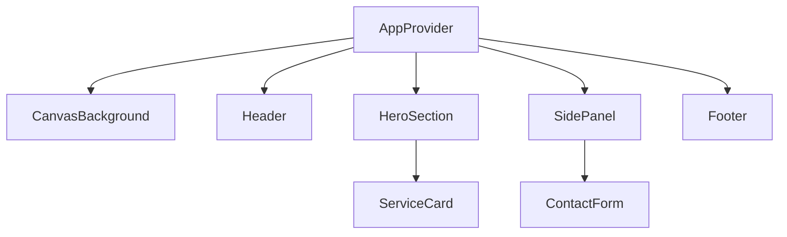
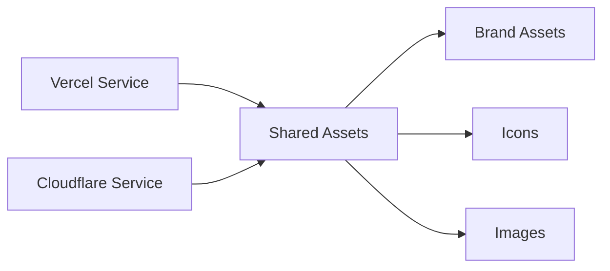
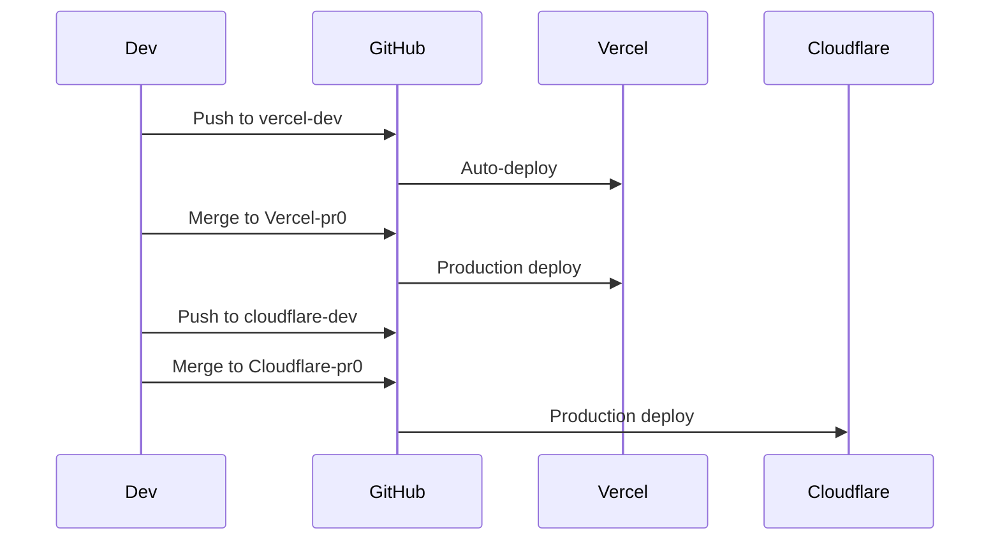

# Documentation Automation

**Purpose**: Guide for automated documentation generation  
**Last Updated**: 2025-01-01

## Overview

This document outlines tools and processes for automating documentation generation and updates.

---

## API Documentation (TypeDoc)

### Setup

```bash
# Install TypeDoc
cd vercel
bun add -D typedoc

# Add script to package.json
{
  "scripts": {
    "docs:generate": "typedoc --out docs/api vercel/components vercel/app"
  }
}
```

### Configuration

Create `typedoc.json`:
```json
{
  "entryPoints": ["vercel/components", "vercel/app"],
  "out": "docs/api",
  "theme": "default",
  "includeVersion": true,
  "excludePrivate": true,
  "excludeProtected": true
}
```

### Generate Documentation

```bash
cd vercel
bun run docs:generate
```

### Automation

Add to GitHub Actions:
```yaml
- name: Generate API docs
  run: |
    cd vercel
    bun run docs:generate
  continue-on-error: true

- name: Commit docs
  if: github.ref == 'refs/heads/main'
  run: |
    git config user.name "GitHub Actions"
    git config user.email "actions@github.com"
    git add docs/api
    git commit -m "docs: Auto-generate API documentation" || exit 0
    git push
```

---

## Architecture Diagrams (Mermaid)

### Component Diagram



### Service Architecture



### Deployment Flow



### Adding Diagrams

1. Create `.md` file with Mermaid code blocks
2. Use Mermaid syntax for diagrams
3. GitHub/GitLab render automatically
4. Include in documentation index

---

## Changelog Automation

### Setup (Conventional Changelog)

```bash
# Install
bun add -D conventional-changelog-cli

# Add script
{
  "scripts": {
    "changelog": "conventional-changelog -p angular -i CHANGELOG.md -s"
  }
}
```

### Generate Changelog

```bash
# Generate from commits
bun run changelog

# Or manually update CHANGELOG.md following format:
```

### Changelog Format

```markdown
# Changelog

## [1.0.0] - 2025-01-01

### Added
- Feature X
- Feature Y

### Changed
- Updated Z

### Fixed
- Bug A
- Bug B
```

---

## Documentation CI/CD

### GitHub Actions Workflow

Create `.github/workflows/docs.yml`:

```yaml
name: Documentation

on:
  push:
    branches: [main, vercel-dev]
    paths:
      - 'vercel/**/*.ts'
      - 'vercel/**/*.tsx'
  workflow_dispatch:

jobs:
  generate-docs:
    runs-on: ubuntu-latest
    steps:
      - uses: actions/checkout@v4
      
      - name: Setup Bun
        uses: oven-sh/setup-bun@v1
      
      - name: Install dependencies
        run: |
          cd vercel
          bun install
      
      - name: Generate API docs
        run: |
          cd vercel
          bun run docs:generate || true
      
      - name: Commit docs
        if: github.ref == 'refs/heads/main'
        run: |
          git config user.name "GitHub Actions"
          git config user.email "actions@github.com"
          git add docs/api
          git commit -m "docs: Auto-generate API documentation" || exit 0
          git push
```

---

## Tools Summary

| Tool | Purpose | Status |
|------|---------|--------|
| TypeDoc | API documentation | ⚠️ To be configured |
| Mermaid | Architecture diagrams | ✅ Ready to use |
| Conventional Changelog | Changelog generation | ⚠️ To be configured |
| GitHub Actions | Automation | ✅ Configured |

---

## References

- **TypeDoc**: https://typedoc.org
- **Mermaid**: https://mermaid.js.org
- **Conventional Changelog**: https://github.com/conventional-changelog
- **GitHub Actions**: https://docs.github.com/en/actions

---

**For documentation index, see [INDEX.md](./INDEX.md)**

